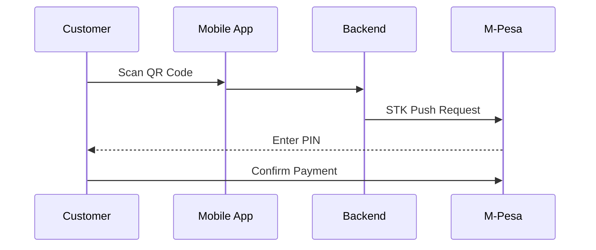
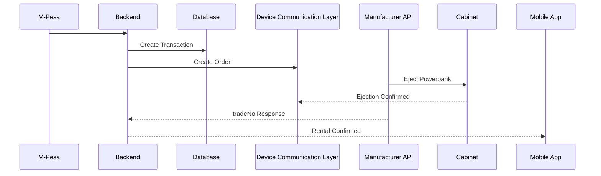
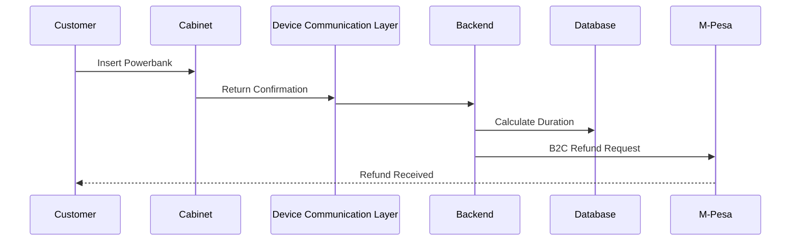
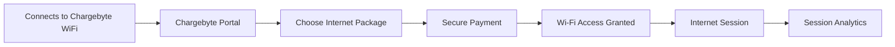

# Chargebyte CSMP Platform


## Overview

The **Chargebyte CSMP (Charging Station Management Platform)** is a cloud-based IoT platform that powers Chargebyte's network of smart power bank stations and community digital services across Africa.

The platform provides centralized management of power bank rentals, secure digital payments, IoT telemetry, environmental monitoring, and community Wi-Fi services through a single intelligent platform. Designed for scalability, Chargebyte CSMP enables operators to remotely monitor station health, optimize operations, improve customer experience, and deliver digital infrastructure to underserved communities.

Beyond power bank rentals, every Chargebyte station is designed to become a **Smart Community Hub**, providing reliable access to power, internet connectivity, and environmental insights.

### Key Capabilities

- **Smart Station Management** – Register, monitor, update, and manage IoT stations remotely.
- **Battery Lifecycle Management** – Track battery availability, charging cycles, health, and utilization.
- **Rental & Customer Management** – Manage rentals, returns, customers, and operational workflows.
- **Digital Payments** – Secure mobile payment processing with automated transaction management.
- **Community Wi-Fi Services** – Provide secure public hotspot access through QR-code onboarding and captive portal authentication.
- **Climate & Environmental Monitoring** – Collect environmental data such as temperature, humidity, and air quality to improve operational planning and community awareness.
- **IoT Telemetry Collection** – Receive real-time operational data from stations for monitoring and analytics.
- **Remote Diagnostics** – Detect issues, monitor equipment health, and support preventive maintenance.
- **Alerts & Notifications** – Intelligent alerts for operational events, connectivity issues, and system health.
- **Analytics & Reporting** – Generate operational, financial, environmental, and utilization insights.

---

## Technology Impact to Communities

Chargebyte stations are designed to provide more than portable power. Each station can serve as a community technology hub by delivering:

- Access to portable power through smart power bank rentals.
- Affordable public Wi-Fi connectivity.
- Secure cashless digital payments.
- Environmental monitoring for smarter infrastructure planning.
- Real-time operational insights that improve service availability.
- Digital inclusion by extending internet access into underserved communities.

---

## System Architecture

```
┌─────────────────────────────────────────────────────────────────┐
│                     IoT Devices (Stations)                      │
│  ┌──────────────┐    ┌──────────────┐    ┌──────────────┐     │
│  │   Station 1   │    │   Station 2   │    │   Station N   │     │
│  │  DTN03048     │    │  DTN03049     │    │  DTN03050     │     │
│  └──────┬───────┘    └──────┬───────┘    └──────┬───────┘     │
└─────────┼───────────────────┼───────────────────┼─────────────┘
          │                   │                   │
          ▼                   ▼                   ▼
    ┌─────────────────────────────────────────────────────────┐
    │              Device Communication Layer                 │
    │      Secure APIs • Webhooks • Telemetry Processing      │
    └─────────────────────────────────────────────────────────┘
          │                   │                   │
          └───────────────────┼───────────────────┘
                              ▼
                    ┌─────────────────┐
                    │   Webhooks      │
                    │   Callbacks     │
                    └────────┬────────┘
                             ▼
┌─────────────────────────────────────────────────────────────────┐
│                     Backend Services                            │
│  ┌─────────────────────────────────────────────────────────┐  │
│  │                  Application Services                   │  │
│  │  Device Management                                      │  │
│  │  Rental Management                                      │  │
│  │  Payment Processing . Telemetry Processing              │  │
│  │  Customer Management . Notifications & Alerts           │  │
│  └─────────────────────────────────────────────────────────┘  │
│  ┌─────────────────────────────────────────────────────────┐  │
│  │               M-Pesa Integration                        │  │
│  │  STK Push │ B2C Refunds │ Callback Processing           │  │
│  └─────────────────────────────────────────────────────────┘  │
│  ┌─────────────────────────────────────────────────────────┐  │
│  │               Payment Processing                        │  │
│  │  Initiate │ Polling │ Callback │ Refund Management      │  │
│  └─────────────────────────────────────────────────────────┘  │
└─────────────────────────────────────────────────────────────────┘
                              │
                              ▼
┌─────────────────────────────────────────────────────────────────┐
│                    PostgreSQL Database                          │
│  ┌──────────┐  ┌──────────┐  ┌──────────┐  ┌──────────┐      │
│  │ Rentals  │  │Transactns│  │ Callbacks│  │  Users   │      │
│  └──────────┘  └──────────┘  └──────────┘  └──────────┘      │
│  ┌──────────┐  ┌──────────┐  ┌──────────┐                     │
│  │ Devices  │  │ Stations │  │  Meters  │                     │
│  └──────────┘  └──────────┘  └──────────┘                     │
└─────────────────────────────────────────────────────────────────┘
                              │
                              ▼
┌─────────────────────────────────────────────────────────────────┐
│                    Admin Dashboard                              │
│  Real-time Monitoring │ Analytics │ Device Management           │
└─────────────────────────────────────────────────────────────────┘
```

---

## Community Wi-Fi Services

Chargebyte stations can provide managed public internet access using an embedded industrial networking solution with hotspot functionality.

Users simply connects tou our Chargebyte WiFi, select an internet package, complete secure payment, and receive immediate internet access through a captive portal.

### Wi-Fi Features

- Secure captive portal authentication
- Time-based internet packages
- Session management
- Usage analytics
- Network health monitoring
- Remote hotspot administration
- Community connectivity reporting

---

## Climate Intelligence

Each station can collect environmental information that supports operational efficiency and community awareness.

Typical environmental metrics include:

- Ambient temperature
- Relative humidity
- Air quality (where available)
- Internal equipment temperature
- Environmental trends
- Weather-related operational indicators

These insights help operators optimize station performance while providing valuable environmental information for communities and deployment planning.

---

## IoT Telemetry Schema

### Station Telemetry Payload
```json
{
  "deviceId": "DTN03048",
  "stationId": "ST001",
  "timestamp": "2026-07-30T08:00:00Z",
  "location": {
    "latitude": -1.2882396885696308,
    "longitude": 36.82320792463758
  },
  "batterySlots": [
    {
      "slot": 1,
      "batteryId": "F0F001FF4B",
      "level": 87,
      "status": "available",
      "temperature": 25.5
    },
    {
      "slot": 2,
      "batteryId": "F0F001FF5B",
      "level": 45,
      "status": "rented",
      "temperature": 26.1
    }
  ],
  "system": {
    "temperature": 28.5,
    "network": "online",
    "firmwareVersion": "1.2.3",
    "uptime": 86400,
    "signalStrength": -65
  }
}
```

### Telemetry Field Definitions

| Field | Type | Description |
|-------|------|-------------|
| `deviceId` | string | Unique IoT device identifier |
| `stationId` | string | Charging station identifier |
| `timestamp` | datetime | Time of telemetry collection |
| `location.latitude` | float | Station GPS latitude |
| `location.longitude` | float | Station GPS longitude |
| `batterySlots[].slot` | integer | Slot number (1-20) |
| `batterySlots[].batteryId` | string | Unique battery identifier |
| `batterySlots[].level` | integer | Battery percentage (0-100) |
| `batterySlots[].status` | string | available, rented, charging, maintenance |
| `batterySlots[].temperature` | float | Battery temperature in °C |
| `system.temperature` | float | Station temperature in °C |
| `system.network` | string | online, offline, degraded |
| `system.firmwareVersion` | string | Current firmware version |
| `system.uptime` | integer | Seconds since last reboot |
| `system.signalStrength` | integer | Network signal strength (dBm) |

---

## Rental Flow

### 1. Customer Initiates Rental


### 2. Payment Processing


### 3. Return & Refund


## M-Pesa Integration

### STK Push Flow
1. Customer initiates payment
2. System sends STK push to customer's phone
3. Customer enters PIN
4. M-Pesa sends callback to our system
5. System processes payment and creates manufacturer order
6. Powerbank is ejected from cabinet

### B2C Refund Flow
1. Customer returns powerbank
2. Device Communication Layer sends return callback
3. System calculates duration and cost
4. System sends B2C refund to customer's M-Pesa
5. Customer receives refund

---

## Community Wi-Fi Journey

In addition to power bank rentals, every Chargebyte station can function as a **Community Internet Access Point**.

Customers scan the station QR code, choose an internet package, complete secure payment, and receive immediate access through a secure captive portal.



### Community Wi-Fi Features

- Secure captive portal authentication
- Flexible internet packages
- Session monitoring
- Network health monitoring
- Remote hotspot administration
- Usage analytics
- Community connectivity reporting

---

# Climate Intelligence

Chargebyte stations can be equipped with environmental sensors that continuously monitor local conditions.

Environmental information helps improve equipment reliability while supporting data-driven planning for communities and infrastructure operators.

### Environmental Metrics

| Metric | Purpose |
|---------|----------|
| Ambient Temperature | Equipment protection |
| Relative Humidity | Environmental monitoring |
| Air Quality | Community environmental insights |
| Internal Cabinet Temperature | Device health monitoring |
| Climate Trends | Historical environmental analysis |

---

# Monitoring & Analytics Dashboard

The Chargebyte CSMP Dashboard provides centralized operational visibility across every deployed station.

### Dashboard Modules

- Live Station Monitoring
- Battery Inventory
- Rental Analytics
- Revenue Dashboard
- Community Wi-Fi Analytics
- Climate Dashboard
- Device Health Monitoring
- Customer Management
- Alerts & Notifications

### Key Performance Indicators

- Active Stations
- Available Batteries
- Daily Rentals
- Revenue
- Wi-Fi Sessions
- Internet Usage
- Device Uptime
- Battery Health Score
- Environmental Conditions
- Network Availability

---

## Smart Station Hardware

Each Chargebyte station combines multiple technologies into a single smart infrastructure platform.

### Embedded Components

- IoT Controller
- Smart Battery Management System
- QR Code Interface
- Industrial Networking Equipment
- Embedded Internet Router
- Hotspot Gateway
- Environmental Sensors
- Remote Diagnostics Module

---

# Security

Chargebyte CSMP is designed with security and privacy as core principles.

The public repository intentionally excludes production infrastructure, proprietary communication protocols, deployment configurations, API endpoints, credentials, and sensitive implementation details.

Security practices include:

- Encrypted communications
- Secure authentication
- Device identity verification
- Role-based access control
- Audit logging
- Continuous system monitoring

---

# Community Impact

Chargebyte is more than a power bank rental platform.

Each station is designed to become a **Smart Community Hub** that supports digital inclusion by providing:

- Portable energy access
- Affordable internet connectivity
- Cashless digital payments
- Environmental awareness through climate monitoring
- Operational intelligence for smarter infrastructure
- Better access to digital services

This approach enables a single deployment to improve access to power, connectivity, and technology while generating valuable operational and environmental insights.

---

# Future Roadmap

Upcoming platform enhancements include:

- AI-powered predictive maintenance
- Battery demand forecasting
- Smart energy optimization
- Renewable energy integration
- Expanded environmental sensing
- Community Wi-Fi analytics
- Smart city integrations
- Carbon impact reporting
- Multi-country deployments

---

## Technology Stack

### Backend
- **Runtime**: Node.js
- **Framework**: Express.js
- **Database**: PostgreSQL
- **ORM/Query**: Raw SQL with connection pooling
- **Authentication**: JWT-based authentication
- **Payment Integration**: M-Pesa Daraja API (STK Push & B2C)
- **IoT Integration**: REST APIs & Webhooks

### Frontend (Dashboard)
- **Framework**: React.js
- **State Management**: Redux
- **UI Library**: Material-UI / Ant Design
- **Charts**: Recharts / Chart.js
- **Real-time**: WebSocket / Socket.io

### DevOps
- **Hosting**: Ubuntu Server
- **Process Management**: PM2
- **Reverse Proxy**: Nginx
- **SSL**: Sectigo
- **Monitoring**: PM2 logs, custom logging

---


## Error Handling & Monitoring

### Logging
- Application logs via PM2
- Error logs separated from output logs
- Structured logging with timestamps

### Recovery Procedures
1. **Failed STK Push**: Retry or user initiates again
2. **Manufacturer API Timeout**: Automatic retry with fallback
3. **Double Ejection Prevention**: Race condition protection
4. **Failed Refund**: Manual intervention possible

## License

Proprietary - All rights reserved. Chargebyte Africa © 2026

---

## Contact

- **Website**: https://chargebyte.io
- **Support**: support@chargebyte.io
- **Management**: management@chargebyte.io

---

## Version History

- **v1.0.0** - Initial release with core rental and payment functionality
- **v1.1.0** - Added refund processing with B2C
- **v1.2.0** - Race condition fixes and improved error handling
