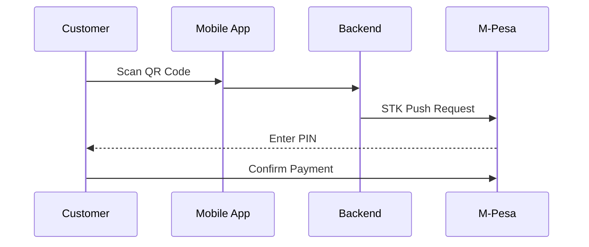
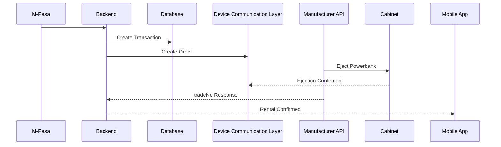
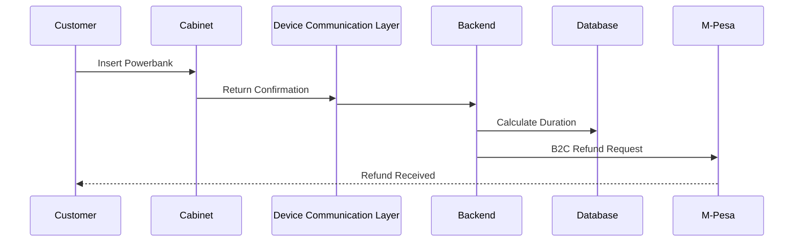

# Chargebyte CSMP Platform


## Overview

The **Chargebyte CSMP (Charging Station Management Platform)** is a comprehensive cloud-based IoT platform designed to manage Chargebyte powerbank rental stations across multiple locations in Africa. The platform provides end-to-end management of powerbank rentals, from station monitoring to payment processing and customer management.

### Key Capabilities

- **Device & Station Management** - Register, monitor, and manage charging stations remotely
- **Battery Inventory Management** - Track battery health, availability, and lifecycle
- **Customer Rental Management** - Handle powerbank rentals, returns, and refunds
- **Payment Processing** - Integrated M-Pesa STK push payments and automated refunds
- **IoT Telemetry Collection** - Real-time data from stations and batteries
- **Remote Diagnostics** - Monitor station health and perform remote troubleshooting
- **Alerts & Notifications** - Automated alerts for system events and anomalies
- **Reporting & Analytics** - Generate insights on usage, revenue, and performance

---

## System Architecture

```
┌─────────────────────────────────────────────────────────────────┐
│                     IoT Devices (Stations)                      │
│  ┌──────────────┐    ┌──────────────┐    ┌──────────────┐     │
│  │   Station 1   │    │   Station 2   │    │   Station N   │     │
│  │  DTN03048     │    │  DTN03049     │    │  DTN03050     │     │
│  └──────┬───────┘    └──────┬───────┘    └──────┬───────┘     │
└─────────┼───────────────────┼───────────────────┼─────────────┘
          │                   │                   │
          ▼                   ▼                   ▼
    ┌─────────────────────────────────────────────────────────┐
    │              Device Communication Layer                 │
    │      Secure APIs • Webhooks • Telemetry Processing      │
    └─────────────────────────────────────────────────────────┘
          │                   │                   │
          └───────────────────┼───────────────────┘
                              ▼
                    ┌─────────────────┐
                    │   Webhooks      │
                    │   Callbacks     │
                    └────────┬────────┘
                             ▼
┌─────────────────────────────────────────────────────────────────┐
│                     Backend Services                            │
│  ┌─────────────────────────────────────────────────────────┐  │
│  │                  Application Services                   │  │
│  │  Device Management                                      │  │
│  │  Rental Management                                      │  │
│  │  Payment Processing . Telemetry Processing              │  │
│  │  Customer Management . Notifications & Alerts           │  │
│  └─────────────────────────────────────────────────────────┘  │
│  ┌─────────────────────────────────────────────────────────┐  │
│  │               M-Pesa Integration                        │  │
│  │  STK Push │ B2C Refunds │ Callback Processing           │  │
│  └─────────────────────────────────────────────────────────┘  │
│  ┌─────────────────────────────────────────────────────────┐  │
│  │               Payment Processing                        │  │
│  │  Initiate │ Polling │ Callback │ Refund Management      │  │
│  └─────────────────────────────────────────────────────────┘  │
└─────────────────────────────────────────────────────────────────┘
                              │
                              ▼
┌─────────────────────────────────────────────────────────────────┐
│                    PostgreSQL Database                          │
│  ┌──────────┐  ┌──────────┐  ┌──────────┐  ┌──────────┐      │
│  │ Rentals  │  │Transactns│  │ Callbacks│  │  Users   │      │
│  └──────────┘  └──────────┘  └──────────┘  └──────────┘      │
│  ┌──────────┐  ┌──────────┐  ┌──────────┐                     │
│  │ Devices  │  │ Stations │  │  Meters  │                     │
│  └──────────┘  └──────────┘  └──────────┘                     │
└─────────────────────────────────────────────────────────────────┘
                              │
                              ▼
┌─────────────────────────────────────────────────────────────────┐
│                    Admin Dashboard                              │
│  Real-time Monitoring │ Analytics │ Device Management           │
└─────────────────────────────────────────────────────────────────┘
```

## Core Data Models

### Rentals Table
### Transactions Table
### M-Pesa Callbacks Table

---

## IoT Telemetry Schema

### Station Telemetry Payload
```json
{
  "deviceId": "DTN03048",
  "stationId": "ST001",
  "timestamp": "2026-07-30T08:00:00Z",
  "location": {
    "latitude": -1.2882396885696308,
    "longitude": 36.82320792463758
  },
  "batterySlots": [
    {
      "slot": 1,
      "batteryId": "F0F001FF4B",
      "level": 87,
      "status": "available",
      "temperature": 25.5
    },
    {
      "slot": 2,
      "batteryId": "F0F001FF5B",
      "level": 45,
      "status": "rented",
      "temperature": 26.1
    }
  ],
  "system": {
    "temperature": 28.5,
    "network": "online",
    "firmwareVersion": "1.2.3",
    "uptime": 86400,
    "signalStrength": -65
  }
}
```

### Telemetry Field Definitions

| Field | Type | Description |
|-------|------|-------------|
| `deviceId` | string | Unique IoT device identifier |
| `stationId` | string | Charging station identifier |
| `timestamp` | datetime | Time of telemetry collection |
| `location.latitude` | float | Station GPS latitude |
| `location.longitude` | float | Station GPS longitude |
| `batterySlots[].slot` | integer | Slot number (1-20) |
| `batterySlots[].batteryId` | string | Unique battery identifier |
| `batterySlots[].level` | integer | Battery percentage (0-100) |
| `batterySlots[].status` | string | available, rented, charging, maintenance |
| `batterySlots[].temperature` | float | Battery temperature in °C |
| `system.temperature` | float | Station temperature in °C |
| `system.network` | string | online, offline, degraded |
| `system.firmwareVersion` | string | Current firmware version |
| `system.uptime` | integer | Seconds since last reboot |
| `system.signalStrength` | integer | Network signal strength (dBm) |

---

## Rental Flow

### 1. Customer Initiates Rental


### 2. Payment Processing


### 3. Return & Refund


## M-Pesa Integration

### STK Push Flow
1. Customer initiates payment
2. System sends STK push to customer's phone
3. Customer enters PIN
4. M-Pesa sends callback to our system
5. System processes payment and creates manufacturer order
6. Powerbank is ejected from cabinet

### B2C Refund Flow
1. Customer returns powerbank
2. Device Communication Layer sends return callback
3. System calculates duration and cost
4. System sends B2C refund to customer's M-Pesa
5. Customer receives refund

---

## Technology Stack

### Backend
- **Runtime**: Node.js
- **Framework**: Express.js
- **Database**: PostgreSQL
- **ORM/Query**: Raw SQL with connection pooling
- **Authentication**: JWT-based authentication
- **Payment Integration**: M-Pesa Daraja API (STK Push & B2C)
- **IoT Integration**: REST APIs & Webhooks

### Frontend (Dashboard)
- **Framework**: React.js
- **State Management**: Redux
- **UI Library**: Material-UI / Ant Design
- **Charts**: Recharts / Chart.js
- **Real-time**: WebSocket / Socket.io

### DevOps
- **Hosting**: Ubuntu Server
- **Process Management**: PM2
- **Reverse Proxy**: Nginx
- **SSL**: Let's Encrypt
- **Monitoring**: PM2 logs, custom logging

---


## Error Handling & Monitoring

### Logging
- Application logs via PM2
- Error logs separated from output logs
- Structured logging with timestamps

### Recovery Procedures
1. **Failed STK Push**: Retry or user initiates again
2. **Manufacturer API Timeout**: Automatic retry with fallback
3. **Double Ejection Prevention**: Race condition protection
4. **Failed Refund**: Manual intervention possible

## License

Proprietary - All rights reserved. Chargebyte Africa © 2026

---

## Contact

- **Website**: https://chargebyte.io
- **Support**: support@chargebyte.io
- **Management**: management@chargebyte.io

---

## Version History

- **v1.0.0** - Initial release with core rental and payment functionality
- **v1.1.0** - Added refund processing with B2C
- **v1.2.0** - Race condition fixes and improved error handling
